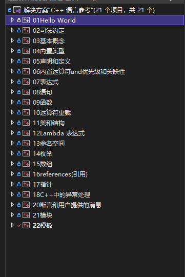

# C++文档笔记

### 说明:

工具 :  Microsoft Visual Studio Community 2022 (64 位) - Current 版本 17.0.0

语言标准 :   C++20 标准

### 仓库:

国内仓库gitee:  [Studynotes/CjiajiaNotes (gitee.com)](https://gitee.com/tianyulk_Android25/CjiajiaNotes)

国外仓库github: [liangke21/CJjiajiaNotes (github.com)](https://github.com/liangke21/CJjiajiaNotes)

